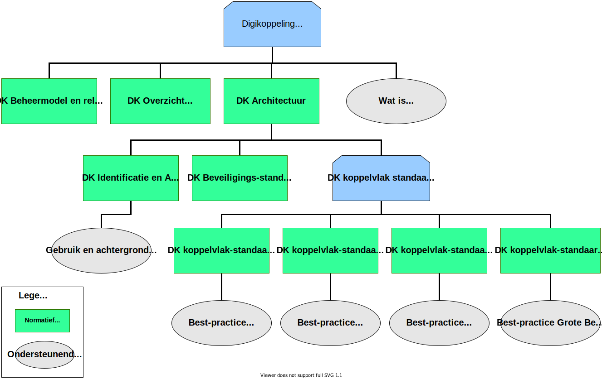

# Inleiding

## Doel en Doelgroep

Dit document beschrijft de eisen die Digikoppeling stelt aan de beveiliging van de berichtuitwisseling.

Dit document is bestemd voor architecten en ontwikkelaars van applicaties die gebruik maken van Digikoppeling om berichten tussen systemen veilig uit te wisselen.

Alle Digikoppeling webservices moeten conformeren aan deze Digikoppeling beveiligingsstandaarden en voorschriften. Deze wordt in dit document gespecificeerd.

Doel van dit document is ontwikkelaars te informeren wat deze beveiligingsvoorschriften precies inhouden, welke standaarden en welke versies toegestaan zijn en partijen zich aan moeten conformeren.

## Digikoppeling 

Deze paragraaf bevat zeer beknopt een aantal hoofdpunten uit de overige documentatie.

Digikoppeling biedt de mogelijkheid om op een sterk gestandaardiseerde wijze berichten uit te wisselen tussen serviceaanbieders (service providers) en serviceafnemers (service requesters of consumers).

De uitwisseling tussen service providers en requesters wordt in drie lagen opgedeeld:

- Inhoud: op deze laag worden de afspraken gemaakt over de inhoud van het uit te wisselen bericht, dus de structuur, semantiek, waardebereiken etc.   
    Digikoppeling houdt zich niet met de inhoud bezig, ‘heeft geen boodschap aan de boodschap’.

- Logistiek: op deze laag bevinden zich de afspraken betreffende transportprotocollen (HTTP & TLS), messaging, beveiliging (authenticatie en encryptie) en betrouwbaarheid. Dit is de laag van Digikoppeling.

- Transport: deze laag verzorgt het daadwerkelijke transport van het bericht (TCP/IP).

Digikoppeling richt zich dus uitsluitend op de logistieke laag. Deze afspraken komen in de koppelvlakstandaarden en andere voorzieningen.

De koppelvlakstandaarden dienen te leiden tot een maximum aan interoperabiliteit met een minimum aan benodigde ontwikkelinspanning. Daarom is gekozen voor bewezen interoperabele internationale standaarden.

## Digikoppeling standaarden 

De documentatie is als volgt opgebouwd:

    
 Tekstalternatief 

<ul>
	<li>Digikoppeling Standaard
		<ul>
			<li> <a href="https://gitdocumentatie.logius.nl/publicatie/dk/beheer/">DK Beheermodel en releasebeleid</a>* </li>
			<li> <a href="https://gitdocumentatie.logius.nl/publicatie/dk/actueel/">DK Overzicht Actuele Documentatie en Compliance</a>* </li>
			<li> <a href="https://gitdocumentatie.logius.nl/publicatie/dk/architectuur">DK Architectuur</a>*
				<ul>
					<li> <a href="https://gitdocumentatie.logius.nl/publicatie/dk/idauth/">DK Identificatie en Authenticatie</a>*
						<ul>
							<li><i> <a href="https://gitdocumentatie.logius.nl/publicatie/dk/gbachtcert/">Digikoppeling Gebruik en Achtergronden Certificaten</a></i>† </li>
						</ul>
					</li>
					<li> <a href="https://gitdocumentatie.logius.nl/publicatie/dk/beveilig/">DK Beveiligingsstandaarden en voorschriften</a>* </li>
					<li>Koppelvlakstandaarden
						<ul>
							<li> <a href="https://gitdocumentatie.logius.nl/publicatie/dk/wus/">DK Koppelvlakstandaard WUS</a>*
								<ul>
									<li><i><a href="https://gitdocumentatie.logius.nl/publicatie/dk/bpwus">Best-practice WUS</a></i>† </li>
								</ul>
							</li>
							<li> <a href="https://gitdocumentatie.logius.nl/publicatie/dk/ebms/">DK Koppelvlakstandaard ebMS2</a>*
								<ul>
									<li> <i><a href="https://gitdocumentatie.logius.nl/publicatie/dk/bpebms">Best-practice ebMS2</a></i>† </li>
								</ul>
							</li>
							<li> <a href="https://gitdocumentatie.logius.nl/publicatie/dk/gb/">DK Koppelvlakstandaard Grote Berichten</a>*
								<ul>
									<li> <i><a href="https://gitdocumentatie.logius.nl/publicatie/dk/bpgb">Best-practice Grote Berichten</a></i>†</li>
								</ul>
							</li>
						</ul>
					</li>
				</ul>
			</li>
			<li>
    <i><a href="https://gitdocumentatie.logius.nl/publicatie/dk/watisdk/">Wat is Digikoppeling</a></i>†
  </li>
		</ul>
	</li>
</ul>

* Normatief document

† Ondersteunend document

- Alle groene documenten vallen onder het beheer zoals geformaliseerd in het [[[?DK-Beheermodel]]].

- Alle goedgekeurde documenten zijn te vinden op de website van Logius: [[[DK-Doc]]].

  

